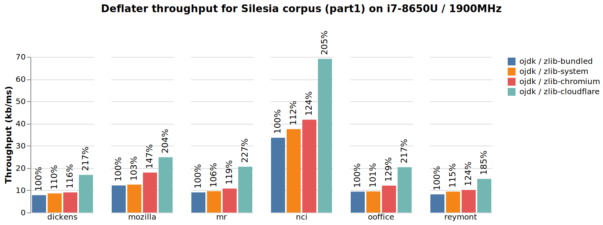
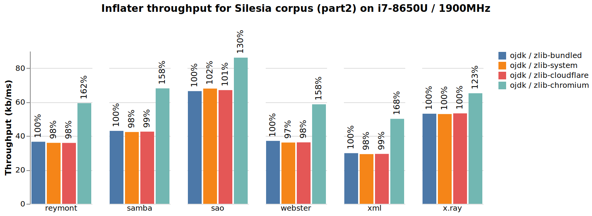
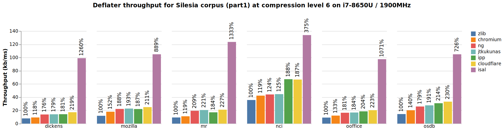
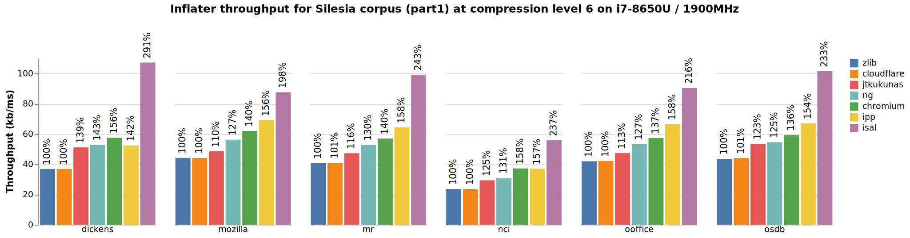

# Accelerating zlib compression & decompression in OpenJDK

By integrating Cloudflare’s and Chromium’s enhanced zlib versions into OpenJDK, we’ve improved zlib decompression speed by about 50% and compression speed up to 100%. After successfully using the new implementations for several services, we’ve decided to [propse these improvements for inclusion into upstream OpenJDK](https://bugs.openjdk.org/browse/JDK-8249963) for the benefit of the community and in order to gather more usage feedback. The new implementations are optional and are controlled by three new system properties.

The following two graphs show the de-/compression throughput achieved by OpenJDK 11 with the new system property `-Dorg.openjdk.zlib.implementation` set to  `bundled`, `system`, `cloudflare,` `chromium` for a selected set of files from the commonly used [Silesia compression corpus](http://sun.aei.polsl.pl/~sdeor/index.php?page=silesia) at the default compression level 6. You can find the full set of graphs [online](https://github.com/simonis/zlib-bench/tree/master/graphs).

|  |
|-------|
|  |

## What is zlib?

Before going into detail, let’s first define what “zlib” stands for. The term is quite overloaded, as it is often used interchangeably to denote either a file format, a compression algorithm or a specific implementation. First and foremost, [zlib](https://www.zlib.net/) is the name of a library written by [Jean-loup Gailly](https://en.wikipedia.org/wiki/Jean-loup_Gailly)  and [Mark Adler](https://en.wikipedia.org/wiki/Mark_Adler) which implements the “zlib compressed data format” (defined in [RFC 1950](https://www.ietf.org/rfc/rfc1950.txt)) and the “gzip file format” (defined in [RFC 1952](https://www.ietf.org/rfc/rfc1952.txt)). They both internally use the “Deflate” compressed data format (defined in [RFC 1951](https://www.ietf.org/rfc/rfc1951.txt)) as their compression format. Second, the “zip file format” ([defined by PKware Inc](http://www.pkware.com/documents/casestudies/APPNOTE.TXT) and later partially standardized by [ISO/IEC 21320-1:2015](http://www.iso.org/iso/home/store/catalogue_tc/catalogue_detail.htm?csnumber=60101)) is a container file format which can contain more than one, possibly “Deflate”-compressed files, in contrast to the gzip file format, which only supports a single file.

It is important to mention that “Deflate” (aka  [RFC 1951](https://www.ietf.org/rfc/rfc1951.txt)) does not specify an exact compression algorithm but a compressed data format which is a combination of  “[Huffman Coding](https://doi.org/10.1109%2FJRPROC.1952.273898)“ and the output produced by the [LZ77 algorithm](https://doi.org/10.1109%2FTIT.1977.1055714). This means that there are different ways to produce RFC 1951 compliant compressed data streams which may require different computation overhead and result in different compression ratios. However, as long as the deflater generates RFC 1951 compliant data, any RFC 1951 compliant inflater will be able to restore the original input data from it. For example, the 9 different compression levels supported by the original zlib implementation are not preserved in the generated deflated data stream, and they are not required by a compliant decompressor to inflate the data.

Since its appearance in the early 90s, the zlib compressed data format has become a de-facto compression standard and the original zlib library has become the standard implementation (and a default package) on many platforms. 

## Java and zlib - a long history

JDK 1.0 supported class loading from zip files on the class path. However, in the initial release, only uncompressed zip files were supported (i.e., the zip files were used merely as containers for bundling files). This changed in JDK 1.1 when support for compressed zip files was added and the .jar format was introduced as a simple zip-file wrapper. You might find the corresponding Changelog entry interesting: I found it in an [historic JDK version](https://www.oracle.com/java/technologies/oracle-java-archive-downloads.html) :).

```
Changes from JDK 1.1beta3 to JDK 1.1_Final
...
JAR CHANGE - Can now handle compressed JAR files in the CLASSPATH

java.util.zip.ZipFile was enhanced so that it can now handle
compressed ZIP/JAR file entries. No changes to the API were made.
With this change, compressed JAR/ZIP files can now be handled
by javac.

Additionally, the runtime has also changed so that it can now
handle compressed ZIP/JAR files that are specified in the CLASSPATH.
```

With the `java.util.zip` package, JDK 1.1 also added a public API for accessing zip files. It is mostly unchanged and still in use today. Compression/decompression was implemented by calling into the native `libzip.so` library which bundled version 1.0.4 of the original zlib library and exposed its functionality through JNI wrappers. API support for accessing jar files in the `java.util.jar` package was added later in JDK 1.2.

## JDK’s zlib and zip implementation 

Starting with JDK 1.1, zip-file handling was implemented natively in the JDK’s `libzip.so` library. This worked remarkably well, although frequent JNI calls could have a significant negative performance impact, and there were well known stability problems such as crashes when a zip-file was modified/accessed concurrently. The latter problem was mitigated by the system property [-Dsun.zip.disableMemoryMapping](http://hg.openjdk.java.net/jdk7/jdk7/jdk/rev/ee385b4e2ffb) introduced in JDK 5u71/6u23. For the performance issues it took until JDK 9 before OpenJDK developers decided to [reimplement the whole zip-file handling in Java](https://bugs.openjdk.java.net/browse/JDK-8145260). This resulted in a nice performance boost described by [Claes Redestad](https://cl4es.github.io/) in his blog “[Zip lookups](https://cl4es.github.io/2020/04/27/Zip-Lookups.html)“.

In addition to zip-file handling, `java.util.zip` offers data de-/compression functionality and checksum computations which are implemented by JNI down-calls to the corresponding native zlib functions. Especially for calculating short checksums, the JNI overhead can be significant, but has been mostly mitigated by the intrinsification of [CRC32](https://bugs.openjdk.java.net/browse/JDK-7088419), [CRC32C](https://bugs.openjdk.java.net/browse/JDK-8134553) and [Adler32](https://bugs.openjdk.java.net/browse/JDK-8139043) functionality on modern CPUs. For the remaining de-/compression functionality, JNI calls are not that much of a problem, because the JNI overhead is usually small compared to the amount of computation done in the native code.

OpenJDK can be built in two flavors, controlled by the configuration flag `—with-zlib=<bundled|system>`. The `bundled` option statically links a version of zlib which is included in the OpenJDK source tree into `libzip.so,` while the `system` option dynamically links `libzip.so` against the the system zlib version. The default setting for this build time configuration is platform and version dependent. Until JDK 8, the default policy for Linux was `bundled` and [changed to `system`](https://bugs.openjdk.java.net/browse/JDK-8031767) in JDK 9. However, OpenJDK vendors are free to override this setting. On Linux, you can easily check how a JDK was configured by using the following command:

```
$ ldd jdk-8/jre/lib/amd64/libzip.so | grep libz
$ ldd jdk-11/lib/libzip.so | grep libz
libz.so.1 => /lib/x86_64-linux-gnu/libz.so.1 (0x00007ffff7785000)
```

In this example, JDK 8 `libzip.so` was not dynamically linked against the system version of `libz.so`. For JDK 11, `ldd` prints a dependency on `/lib/x86_64-linux-gnu/libz.so.1` for its version of `libzip.so,` meaning that it was dynamically linked against it.

If a JDK uses a version of  `libzip.so` which is dynamically linked against `libz.so,` you can easily use the environment variables `LD_LIBARY_PATH` or `LD_PRELOAD` to force the JDK into using a different, but API-compatible, implementation of `libz.so`.

## The evolution of zlib

As mentioned before, zlib was initially created by J. Gailly and M. Adler back in 1995 when the first version [0.8 was released](https://www.zlib.net/fossils/) (making it just as old as Java :)).  Today, it is still supported by M. Adler on GitHub at https://github.com/madler/zlib. Development has considerably slowed down and new features and improvements are rarely accepted. For a long time version 1.2.11 which was released back in 2017 was the latest stable version. This only changed recently due to [CVE-2018-25032](https://nvd.nist.gov/vuln/detail/CVE-2018-25032) which triggered the release of version 1.2.12 with about 60 pending changes from the zlib development branch.

Due to its age and widespread adoption, ranging from 16-bit home computers to exotic mainframes, zlib carries a lot of legacy code which makes it hard to integrate new features and platform-specific optimizations. This policy has led to the creation of quite a few zlib forks, whose goal it is to improve performance on modern x86-64, and lately aarch64, hardware. To get a better picture of the current situation, I’ve analyzed the most prominent forks with regard to their performance improvements. In addition, I’ve also added [Intel’s open-s isa-l](https://github.com/intel/isa-l) library to the comparison. isa-l is not a zlib fork, but rather an open-source re-implementation of RFC 1950, 1951 and 1952 mostly written in assembler with very interesting performance characteristics.

### zlib-ipp

[zlib-ipp](https://software.intel.com/en-us/articles/intel-ipp-zlib-coding-functions) is a [patch set](https://software.intel.com/en-us/articles/how-to-use-zlib-with-intel-ipp-optimization) for the original zlib library which redirects time consuming computation to Intel’s proprietary [Integrated Performance Primitives](https://software.intel.com/en-us/ipp) (IPP) library. In addition to general improvements for the default zlib compression levels 1-9, zlib-ipp also supports a new, “fastest” compression level (called ‘-2’ in the “throughput/ratio” graph below) and several experimental compression levels for huge and highly compressible data which I haven’t evaluated here. 

Although it requires registration, IPP can be freely downloaded and used under the “[Intel Simplified Software License](https://software.intel.com/en-us/license/intel-simplified-software-license)” license. Unfortunately this license, and especially the fact that the library itself it is only available in binary format, make it unsuitable for integration into OpenJDK. 

### zlib-cloudflare

[zlib-cloudflare](https://github.com/cloudflare/zlib) is a fork by Cloudflare with greatly improved compression speed (details are described in this [blog post](https://blog.cloudflare.com/cloudflare-fights-cancer/)). They cleaned up the old code base, threw away parts which are not necessary on modern platforms, changed the base data types used in the computations to 64-bit counterparts, changed code patterns such that they can be better optimized by modern compilers, and selectively replaced some parts with assembler intrinsics. 

All these improvements result in a nice speed-up, while still maintaining full zlib API compatibility. One small drawback of zlib-cloudflare is the fact that it is based on zlib version 1.2.8, while the upstream project has reached version 1.2.12. Recently, [zlib-cloudflare has integrated some inflater improvements from zlib-chromium](https://aws.amazon.com/blogs/opensource/improving-zlib-cloudflare-and-comparing-performance-with-other-zlib-forks/) which are not refelected in these measurements yet, but bring cloudflares infaltion speed on par with that of zlib-chromium.

### zlib-ng

[zlib-ng](https://github.com/zlib-ng/zlib-ng) is a zlib fork which was created with the goal of improving the implementation in a faster, more liberal, way compared to the original upstream project which prefers stability and a wide range of cross platform compatibility over new features and optimizations. According to the [zlib-ng](https://github.com/zlib-ng/zlib-ng)[page](https://github.com/zlib-ng/zlib-ng), the project has integrated various improvements from the Cloudflare as well as from an old [Intel fork](https://github.com/jtkukunas/zlib) in addition to their own contributions. The project is under active development with many contributors and regular commits.

### zlib-jtkukunas

[Jim Kukunas](https://www.linkedin.com/in/jim-kukunas-60512514/), an engineer working at Intel's Open-Source Technology Center has started back in 2013 to [improve the zlib deflate performance](https://www.phoronix.com/scan.php?page=news_item&px=MTUyNzY) on x86 CPUs with SSE support. He collected his optimization in his own zlib repository at [zlib-jtkukunas](https://github.com/jtkukunas) which became the base for other forks like cloudlflare or ng mentioned before. 

### zlib-chromium

[zlib-chromium](https://chromium.googlesource.com/chromium/src/third_party/zlib/) is the [Chromium](https://www.chromium.org/Home) project’s fork of the original zlib implementation. The main focus is on the improvement of decompression speed. Because it is used within the Chrome browser, it comes with many optimizations for the various ARM architectures and supports a wide range of platforms. As a zlib-fork, it is API compatible with the original zlib version.

### isa-l

The [Intel Intelligent Storage Acceleration Library](https://github.com/intel/isa-l) (ISA-L) is a “*collection of optimized low-level functions targeting storage applications*”. It  includes an [RFC 1591](https://tools.ietf.org/html/rfc1951) compatible deflater implementation with a different API compared to the original zlib (e.g., it supports only 4 compression levels compared to the 9 levels supported by zlib). The focus of “isa-l” is clearly on performance and about half of the deflater/inflater library is written in pure [NASM](https://www.nasm.us/) assembler code. It accelerates compression multiple times at the expense of a slight degradation of compression ratio (see the throughput/ratio graph below). Unfortunately it can not be used as a simple drop-in replacement for zlib because of its slightly different API.

### Performance comparison

I’ve used files from the [Silesia compression corpus](http://sun.aei.polsl.pl/~sdeor/index.php?page=silesia) to compare the inflate/deflate speed of the different implementations. While they all produce fully [RFC 1591](https://tools.ietf.org/html/rfc1951) compatible compressed data streams, they compress data to a different extent (even at the same compression level) so it is not easy to compare their compression speed in an objective way.

For single input files, I’ve produced graphs which show the compression throughput and ratio depending on the compression level. From a high level perspective, these graphs look similar for all files. E.g., isa-l is almost always the fastest implementation but usually produces slightly less compressed results. The exact deltas vary for different input files. You can find the graphs for each of the files from the Silesia corpus as well as the benchmark sources in [my GitHub repository](https://github.com/simonis/zlib-bench/tree/master/graphs). 

|  |
|-------|

This graph shows the deflater throughput and compression ratio at various compression levels. Higher compression ratios result in smaller compressed files. E.g., a compression ratio of 3 means that an input file will be compressed to one third (i.e. 33%) of its initial size.

While the above throughput/ratio graph highlights the differences of the various implementations depending on the compression level, I’ve also created graphs which highlight the differences in deflation speed for various data types at a fixed compression level. For these benchmarks I’ve used compression level 6 for zlib forks because that’s the default zlib compression level, and is probably the most frequently used one. For isa-l I chose level 3 because it compresses the data at a ratio which is closest to the compression ratio of zlib at level 6.

|  |
|-------|


For inflation we don’t have different inflation levels. Compressed data at all levels will be decompressed by the same algorithm. In order to make the results comparable, I’ve pre-compressed all the data files with the original zlib version at compression level 6. Again, you can find a complete set of graphs in [my GitHub repository](https://github.com/simonis/zlib-bench/tree/master/graphs)

|  |
|-------|

### Conclusion

isa-l is clearly the winner for both compression and decompression. However, its different API and the lower compression ratio make it unsuitable as a simple drop-in replacement for zlib. zlib-ipp comes in second for inflation tightly followed by zlib-chromium. For deflation, zlib-cloudflare and zlib-ipp are about on par.

With these results, and taking into account that zlib-ipp depends on a proprietary, binary-only library, we’ve decided to propose both, zlib-cloudflare for compression and zlib-chromium for decompression, for integration into OpenJDK. With the changes which were required to make this possible, it becomes easy to add different implementations in the future. 

## Integrating zlib-cloudflare and zlib-chromium into OpenJDK

zlib-cloudflare and zlib-chromium have been [proposed for integration into OpenJDK](https://bugs.openjdk.org/browse/JDK-8249963) in parallel with the existing, [default zlib implementation](https://github.com/openjdk/jdk/tree/jdk-20+1/src/java.base/share/native/libzip). Their actual inclusion into a jdk image is controlled by the new configuration flag `—with-additional-zlib=<(cloudflare,chromium)|none>`. It currently supports a list of the values `(cloudflare,chromium)`, or the value `none` to exclude any additional implementation. The default value for `—with-additional-zlib` is `cloudflare,chromium` on Linux/Windows/MacOS/x86_64 and Linux/aarch64 and `none` on all other platforms. It is also possible to only include a single additional implementation (e.g. `—with-additional-zlib=chromium`) or to exclude all additional implementations even on supported platforms with `—with-additional-zlib=none`.

Once a new implementation has been built into the JDK, it can be enabled at runtime by setting one of the following new system properties:

```
-Dorg.openjdk.zlib.implementation=<cloudflare|chromium|bundled|system>          (1)
-Dorg.openjdk.zlib.implementation.inflate=<cloudflare|chromium|bundled|system>  (2)
-Dorg.openjdk.zlib.implementation.deflate=<cloudflare|chromium|bundled|system>  (3) 
```

`bundled` chooses the original, bundled version of zlib, or the system-wide version if the JDK was configured with `--with-zlib=system`.

`system` tries to load a version of zlib from the system library path, and can be influenced by setting the LD_LIBRARY_PATH/LD_PRELOAD environment variables. If it fails, the JDK will gracefully fall back to the `bundled` implementation.

The second and third property can be used to change the inflate/deflate implementation selectively. The default for all three properties is `bundled`. For best deflate and infalte performance we currently recommend the following settings:

```
-Dorg.openjdk.zlib.implementation.inflate=chromium
-Dorg.openjdk.zlib.implementation.deflate=cloudflare 
```

These properties must be specified at start-up and are not manageable. Setting or changing them later will have no effect.

### Implementation details

For the alternative zlib implementations, all functions are redefined with a unique prefix at build time and statically linked into the `libzip.so`, which exports their functionality. This means that all public functions from zlib-cloudflare are prefixed with ‘`z_`’ (e.g., `deflateInit` becomes `z_deflateInit`) and the ones from zlib-chromium are prefixed with ‘`Cr_z_`’ (e.g., `deflateInit` becomes `Cr_z_deflateInit`). This function renaming is a feature already present in the original zlib version and implemented with the help of the C preprocessor.

`libzip.so` has been changed to use function pointers instead of directly calling into zlib (see [src/java.base/share/native/libzip/dispatch.c](http://cr.openjdk.java.net/~simonis/webrevs/2020/8249963/src/java.base/share/native/libzip/dispatch.c.html)). At startup, and depending on the value of the  `org.openjdk.zlib.implementation` system properties, these function pointers can be re-assigned to point to the desired implementation. A nice benefit of this approach is that it becomes possible to use the system zlib version even if the jdk was configured with only a single, bundled zlib. The overhead of the indirect function calls is negligible if we take into account JNI overhead and the amount of time usually spent in the corresponding zlib functions. 

This new dispatch mechanism doesn’t work for `libsplashscreen.so` and the `unpack200` utility, which don’t use `libzip.so` but instead statically link in parts of the original zlib implementation. However, we don’t consider this to be a major problem because `libsplashscreen.so`, if at all, is only used at startup, and `unpack200` is rarely used and deprecated.

## Summary and Outlook

Applications which spent a considerable amount of time in `java.util.zip` can now easily benefit from increased inflation/deflation speed by simply activating the alternative implementations with the help of the new system properties.

We are keen on hearing about your experiences with this feature. Depending on your feedback we might eventually switch the new implementations on by default so that all users will transparently benefit from improved performance.

Finally, it might still be worthwhile investigating ways to integrate Intel’s isa-l library into OpenJDK, because it can multiply the compression speed one more time.

The complete benchmark results together with the benchmark sources can be found in my [GitHub repository](https://github.com/simonis/zlib-bench).

## Acknowledgment

We want to thank J. Gailly and M. Adler for creating a compression format and a library which have turned into de-facto standards. Even after more than 25 years, they are still in active use and development today. We are also grateful to the Cloudflare and Chromium teams which continually improve zlib’s performance. Vlad Krasnov from Cloudflare and Adenilson Cavalcanti from Chromium project with their quick and valuable feedback were especially helpful for the integration of their libraries into OpenJDK.
