## Benchmark details

The following results were measured on a Laptop with an Intel i7-8650U CPU running Ubuntu 18.04. On the laptop, hyperthreading and turbo-boost were switched off, the CPU frequency was set to a fixed value of 1900MHz and the benchmark was run in its own [cpuset](http://manpages.ubuntu.com/manpages/bionic/man1/cset-set.1.html) as root user (see [`benchmarks/bash/benchmark_start.sh`](benchmarks/bash/benchmark_start.sh)). 

### Native benchmarks

For the native benchmarks I've used the program [`zbench.c`](benchmarks/c/zbench.c) and `LD_PRELOAD`ed the various different implementations as can be seen in the harness script [`run-native-deflate.sh`](benchmarks/bash/run-native-deflate.sh). For "`isa-l`", wrapper functions are used which call the correponding inflate/deflate functions of the "`isa-l`" API.

For deflation I've measured throughput (in kb/ms) and the compression ratio for each compression level (-2 and 1 - 9 for "`zlib-ipp`", 0 - 3 for "`isa-l`" and 1 - 9 for all the other libraries) for every file from the [Silesia text corpus](http://www.data-compression.info/Corpora/SilesiaCorpus/index.html).

The next graph shows the deflation throughput of all implementations at the default compression level 6 (for "`isa-l`" I use level 3 which is  the closest to "`zlib`"'s level 6 from a compression ratio point of view). The original "`zlib`"'s throughput is defined to be 100%. You can click on a graph to get a larger version.

| 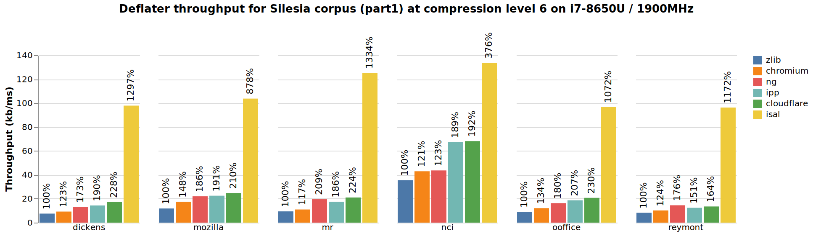 |
|-------|
| 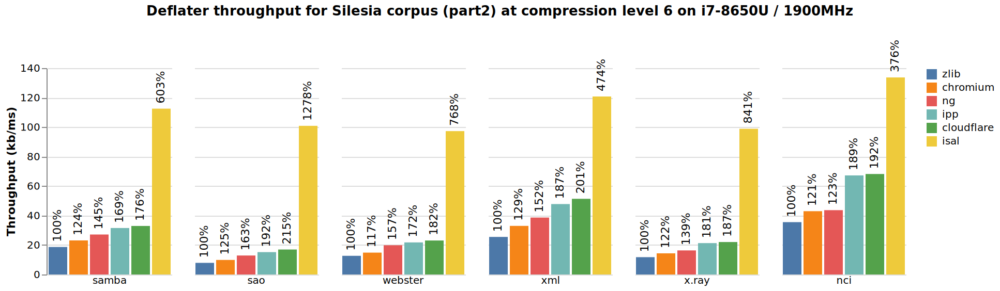 |

The following set of graphs shows the deflate throughput and compression ratio for each of the Silesia files depending on the compression level. Click on a graph for a larger version.

| 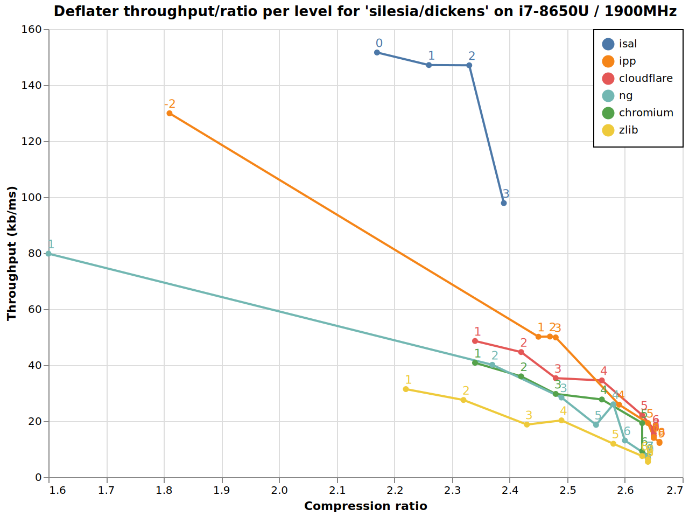 |  |
|-----|-----|
| 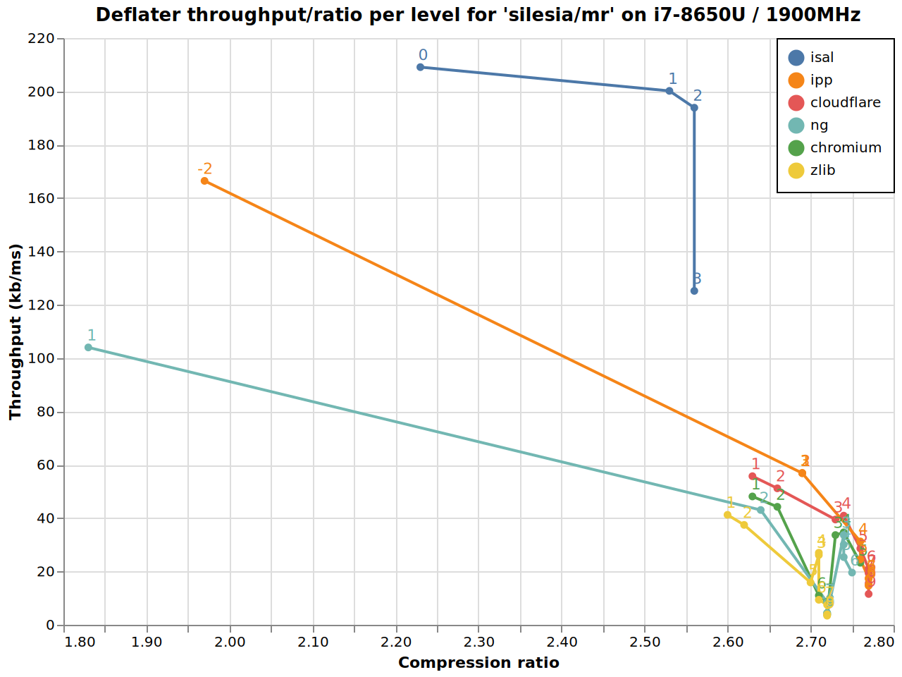 | 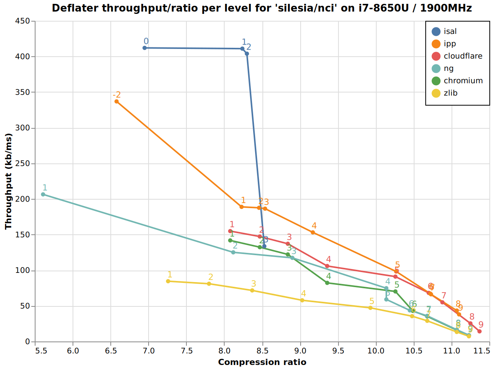 |
| 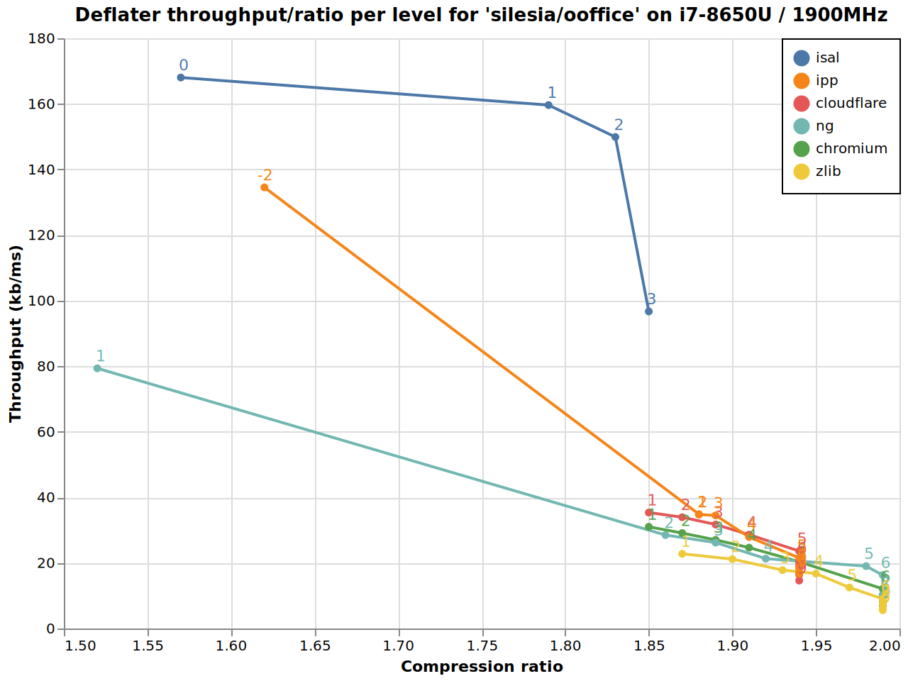 | 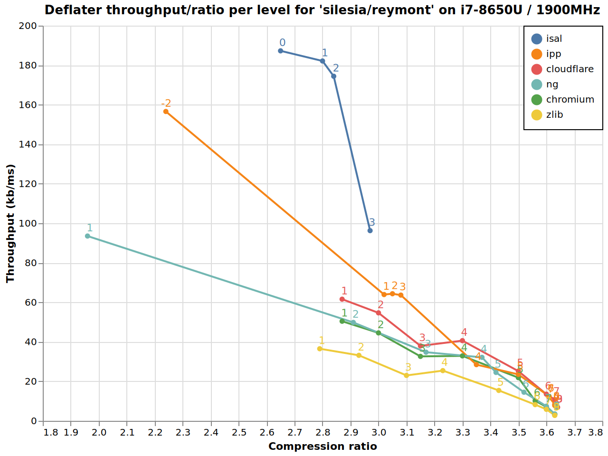 |
| 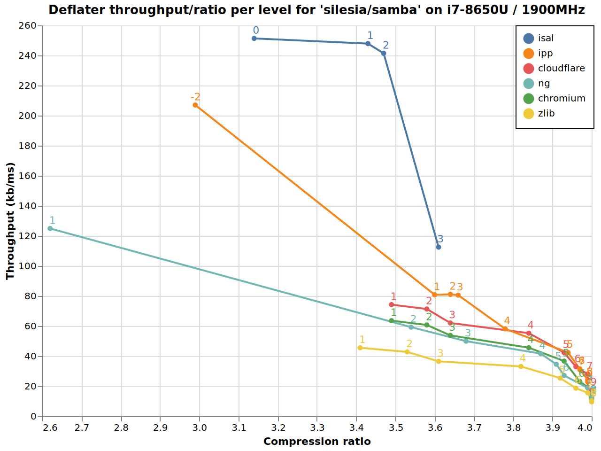 | 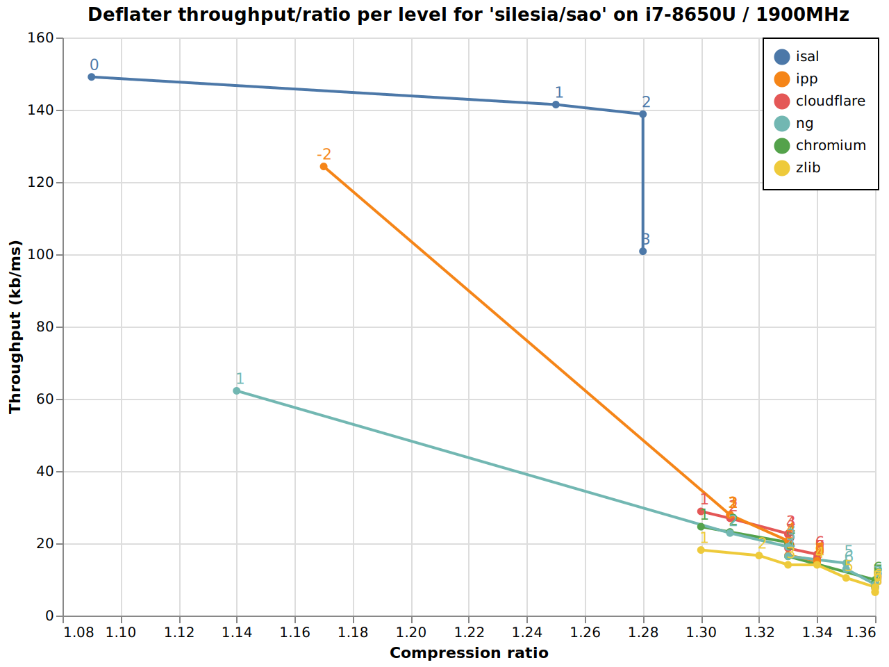 |
| 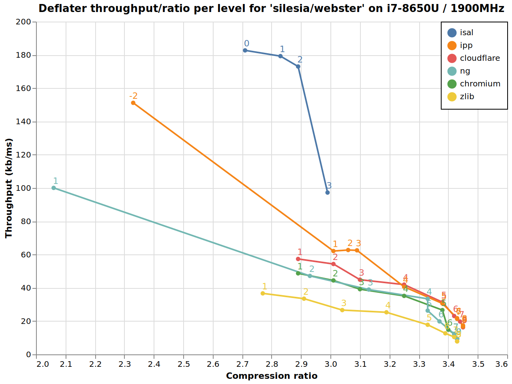 |  |
| 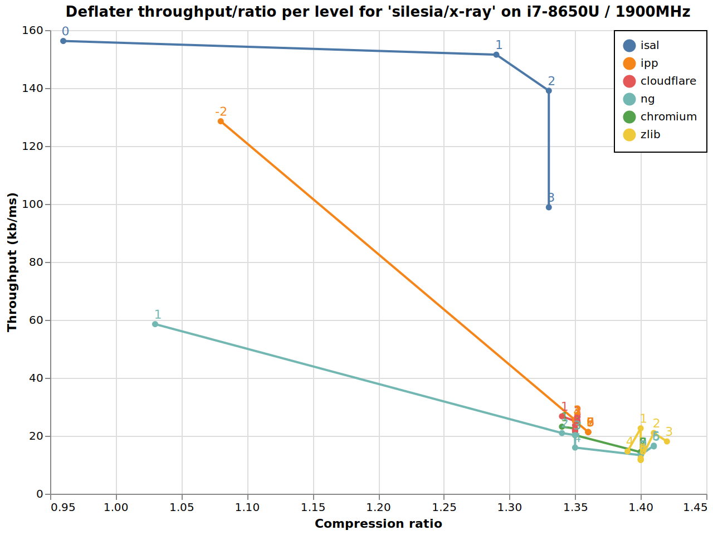 |  |

And finally a comparison of the inflation throughput of the various versions. As input data for all implementations I took the original Silesia files compressed with the original "`zlib`" version at the default compression level 6.

| 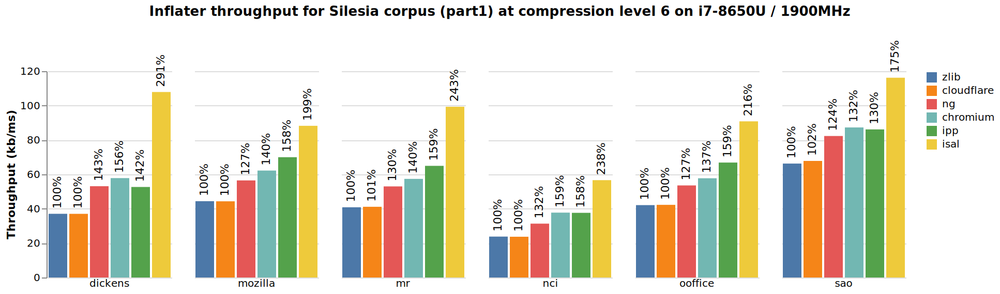 |
|-------|
| 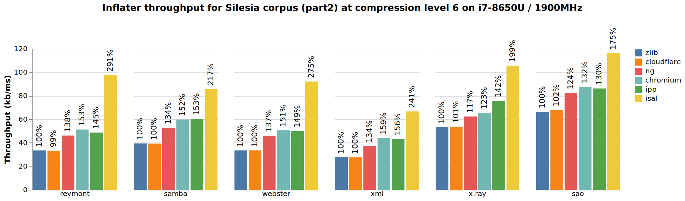 |

